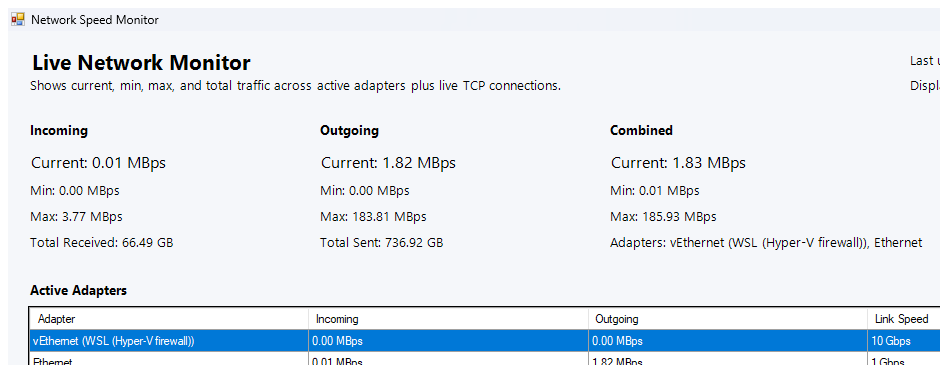

# Windows Network Speed Monitor

Small Windows desktop monitor for live network traffic and active TCP connections.



## Features

- Live incoming, outgoing, and combined network speeds
- Current, minimum, and maximum rates since launch
- Total bytes received and sent
- Active network adapters table
- Established TCP connections with process name, remote IP, remote port, and best-effort hostname lookup
- Sortable tables that keep their sort order during refresh
- Toggle between `Mbps` and `MBps`

## Files

- `Start_Network_Monitor.bat`: launcher
- `scripts/NetworkMonitor.ps1`: main app

## Code Layout

- `script-scope state`: caches, selected display unit, min/max stats, saved grid sort state, and the last sample used by the timer-driven refresh loop
- `Get-ActiveInterfaceRows`: reads active adapter counters from Windows
- `Update-AdapterGrid`: converts adapter counters into current rates and rebuilds the adapter table
- `Update-ConnectionsGrid`: rebuilds the active TCP connections table
- `Refresh-Monitor`: main sampling pass that computes current/min/max values and refreshes the UI
- `ColumnHeaderMouseClick` handlers: keep user-selected sorting active across refreshes
- `unitToggleButton` handler: switches between `Mbps` and `MBps` without changing the internal sampled values

## Run

```powershell
.\Start_Network_Monitor.bat
```

If PowerShell execution policy blocks the script, the launcher already uses `-ExecutionPolicy Bypass` for this app only.

## Download

- Source: clone this repo and run `Start_Network_Monitor.bat`
- Release ZIP: see the GitHub Releases page for a packaged download

## Notes

- Hostnames come from reverse DNS when available.
- Exact website URLs are not available from normal Windows socket data, so the app shows remote IPs and hostnames rather than full pages.
- The app uses built-in Windows PowerShell networking cmdlets such as `Get-NetAdapterStatistics` and `Get-NetTCPConnection`.
